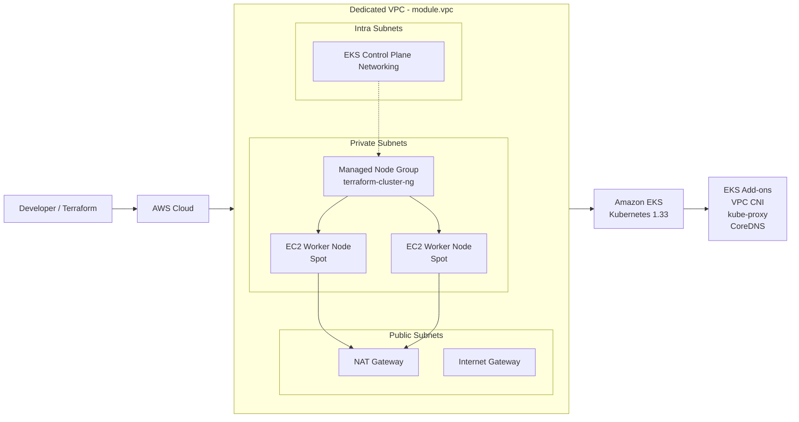

# ☸️ Terraform EKS Infrastructure

### AWS EKS Cluster • Terraform • VPC • Managed Node Group

This repository provisions an **Amazon EKS cluster using Terraform** with the official Terraform AWS modules for **EKS** and **VPC**.

The infrastructure is designed around a dedicated VPC containing **public, private, and intra subnets**. The EKS worker nodes run in the **private subnets**, while the EKS control-plane networking uses the **intra subnets**.

---

## 1. 🏗️ Architecture Overview



> **Important:** The exact VPC CIDR, Availability Zones, subnet CIDRs and cluster name are controlled by the Terraform `locals` referenced in the configuration (`local.vpc_cidr`, `local.azs`, `local.private_subnets`, `local.public_subnets`, `local.intra_subnets`, `local.name`, and `local.env`).

---

## 2. ☸️ EKS Cluster Configuration

The EKS cluster is created using:

```hcl
module "eks" {
  source  = "terraform-aws-modules/eks/aws"
  version = "~> 21.0"
}
```

### Cluster settings

| Configuration | Value |
|---|---|
| EKS Module | `terraform-aws-modules/eks/aws` |
| Module Version | `~> 21.0` |
| Kubernetes Version | `1.33` |
| Endpoint Public Access | Enabled |
| Cluster Name | `local.name` |
| Worker Subnets | `module.vpc.private_subnets` |
| Control Plane Subnets | `module.vpc.intra_subnets` |
| Environment Tag | `local.env` |
| Terraform Tag | `true` |

---

## 3. 🌐 VPC Architecture

The VPC is created using:

```hcl
module "vpc" {
  source = "terraform-aws-modules/vpc/aws"
}
```

The VPC contains three subnet categories:

```text
                    AWS VPC
                       │
          ┌────────────┼────────────┐
          │            │            │
          ▼            ▼            ▼
       PUBLIC       PRIVATE       INTRA
       SUBNETS      SUBNETS      SUBNETS
          │            │            │
          │            ▼            ▼
          │       EKS Nodes    Control Plane
          │
          ▼
      NAT Gateway
```

### VPC features enabled

```hcl
enable_nat_gateway = true
enable_vpn_gateway = true
```

The VPC receives:

- A configurable VPC CIDR
- Configurable Availability Zones
- Public subnets
- Private subnets
- Intra subnets
- NAT Gateway
- VPN Gateway

All of these values are driven by Terraform variables/locals rather than hard-coded in `vpc.tf`.

---

# 4. 🖥️ Managed EKS Node Group

The cluster uses an EKS managed node group:

```hcl
eks_managed_node_groups = {
  terraform-cluster-ng = {
    instance_types = ["t2.micro", "t2.medium"]

    min_size     = 2
    max_size     = 3
    desired_size = 2

    capacity_type = "SPOT"

    attach_cluster_primary_security_group = true
  }
}
```

### Node group configuration

| Setting | Configuration |
|---|---|
| Node Group | `terraform-cluster-ng` |
| Instance Types | `t2.micro`, `t2.medium` |
| Desired Nodes | `2` |
| Minimum Nodes | `2` |
| Maximum Nodes | `3` |
| Capacity | `SPOT` |
| Subnets | Private subnets |
| Cluster Primary SG | Attached |

### Scaling behavior

```text
             EKS Managed Node Group
                      │
                  Desired = 2
                      │
                ┌─────┴─────┐
                ▼           ▼
              Node 1      Node 2
                │           │
                └─────┬─────┘
                      │
                 Scale if needed
                      │
                      ▼
                   Node 3
                Maximum = 3
```

The node group starts with **2 desired nodes**, can scale down no lower than **2**, and can scale up to **3 nodes**.

---

# 5. 🔐 Security & Networking

The EKS managed node group is configured with:

```hcl
attach_cluster_primary_security_group = true
```

This attaches the EKS cluster's primary security group to the managed node group.

The architecture separates network responsibilities:

```text
Internet
   │
   ▼
Public Subnets
   │
   ▼
NAT Gateway
   │
   ▼
Private Subnets
   │
   ▼
EKS Worker Nodes
```

The EKS control-plane networking uses:

```hcl
control_plane_subnet_ids = module.vpc.intra_subnets
```

This keeps the control-plane subnet selection separate from the worker-node private subnet selection.

---

# 6. 🧩 EKS Add-ons

Three standard EKS add-ons are enabled:

### VPC CNI

```hcl
vpc-cni = {
  most_recent = true
}
```

Provides Kubernetes pod networking through the AWS VPC networking model.

### kube-proxy

```hcl
kube-proxy = {
  most_recent = true
}
```

Provides Kubernetes network traffic handling on worker nodes.

### CoreDNS

```hcl
coredns = {
  most_recent = true
}
```

Provides DNS-based service discovery inside the Kubernetes cluster.

### Add-on architecture

```text
                 EKS Cluster
                     │
       ┌─────────────┼─────────────┐
       ▼             ▼             ▼
    VPC CNI       kube-proxy     CoreDNS
       │             │             │
       ▼             ▼             ▼
   Pod Network   Service Traffic  DNS
```

---

# 7. 🔄 How Terraform Builds the Infrastructure

The complete workflow is:

```text
Terraform Configuration
          │
          ▼
     terraform init
          │
          ▼
    Download Modules
          │
          ▼
     terraform plan
          │
          ▼
    Review Changes
          │
          ▼
     terraform apply
          │
          ▼
      Create VPC
          │
          ├──────────────┐
          ▼              ▼
    Create Subnets    NAT/VPN
          │
          ▼
      Create EKS
          │
          ├───────────────┐
          ▼               ▼
   Control Plane     Managed Nodes
                          │
                    2 → 3 Nodes
                          │
                          ▼
                    EKS Add-ons
```

---

# 8. 🚀 Terraform Commands

### Initialize

```bash
terraform init
```

Downloads the required Terraform providers and modules.

### Validate

```bash
terraform validate
```

Checks whether the Terraform configuration is syntactically and structurally valid.

### Format

```bash
terraform fmt -recursive
```

Formats Terraform configuration files.

### Plan

```bash
terraform plan
```

Shows what Terraform intends to create, modify, or destroy.

### Apply

```bash
terraform apply
```

Creates or updates the AWS infrastructure.

### Destroy

```bash
terraform destroy
```

Removes the infrastructure managed by this Terraform configuration.

> Always review the plan carefully before applying or destroying infrastructure.

---

# 9. 📁 Repository Structure

A typical project structure is:

```text
.
├── eks.tf
├── vpc.tf
├── provider.tf
├── terraform.tf
├── variables.tf
├── locals.tf
├── outputs.tf
├── .terraform.lock.hcl
├── .gitignore
└── README.md
```

The exact repository structure may contain additional Terraform files/modules.

---

# 10. 🏷️ Resource Tagging

The infrastructure applies common Terraform/environment tags:

```hcl
tags = {
  Environment = local.env
  Terraform   = "true"
}
```

This makes it easier to identify resources created by Terraform and associate them with the configured environment.

---

# 11. 🔑 Important Notes

- Worker nodes are placed in **private subnets**.
- EKS control-plane networking uses **intra subnets**.
- Public subnets are available for public-facing networking components.
- NAT Gateway is enabled.
- VPN Gateway is enabled.
- EKS API endpoint public access is enabled.
- The managed node group uses **SPOT capacity**.
- Desired node count is **2**.
- Minimum node count is **2**.
- Maximum node count is **3**.
- The node group supports the configured `t2.micro` and `t2.medium` instance types.
- EKS Kubernetes version is **1.33**.
- VPC CNI, kube-proxy and CoreDNS are enabled as managed EKS add-ons.
- `.terraform/` should not be committed to Git.
- `.terraform.lock.hcl` should normally be committed.
- Never commit private SSH keys, `.pem` files, credentials, or secrets.

---

# 12. 🎯 Project Goal

This project demonstrates how Terraform can be used to build a production-style AWS EKS foundation using Infrastructure as Code.

The main concepts demonstrated are:

**Terraform**
→ **AWS VPC**
→ **Public / Private / Intra Subnets**
→ **NAT Gateway**
→ **EKS Control Plane**
→ **Managed Node Group**
→ **SPOT Worker Nodes**
→ **Kubernetes Add-ons**

---

## 🚀 Happy Deploying!

**Terraform + AWS + Kubernetes = Infrastructure as Code**


